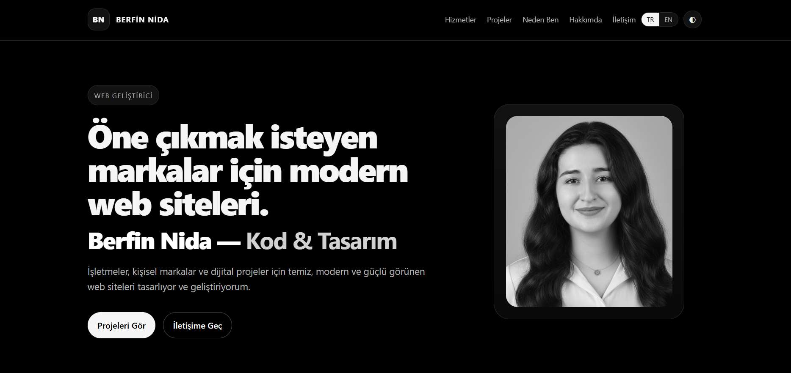

# Berfin Nida Ozturk

Personal portfolio website and project showcase.

---

## About
- Focus: Frontend and UI-first web development
- Based in Istanbul, Turkiye
- Background: Molecular Biology and Genetics -> Web Development

## Live Portfolio
- **Website:** https://berfinida.github.io/Portfolio/

## Featured Projects

### Hotel17
Modern hotel website interface with a premium presentation style and strong atmosphere.
- Demo: https://hotel17-lilac.vercel.app/
- Repo: https://github.com/berfinida/Hotel17

### Cafe17
Restaurant website interface focused on menu experience and brand atmosphere.
- Demo: https://cafe17-adts.vercel.app/
- Repo: https://github.com/berfinida/cafe17

### NizenStore
Modern e-commerce interface focused on product showcase, category flow, and shopping experience.
- Demo: https://nizen-store.vercel.app/
- Repo: https://github.com/berfinida/Nizenstore

### Wandex
Travel discovery concept with a clean and modern user experience.
- Demo: https://wandex-seven.vercel.app/
- Repo: https://github.com/berfinida/Wandex

### ZenithFocus
Modern productivity web app concept focused on deep work, focus, and organized flow.
- Demo: https://zenith-focus-five.vercel.app/
- Repo: https://github.com/berfinida/ZenithFocus

### GoldenVisaKW
Modern web platform for international investment, residency, and citizenship services.
- Demo: https://goldenvisakw.com
- Repo: https://github.com/berfinida/GoldenVisa

## Contact
- **LinkedIn:** https://www.linkedin.com/in/berfin-nida-%C3%B6zt%C3%BCrk-6a12131b7/
- **GitHub:** https://github.com/berfinida
- **WhatsApp:** https://wa.me/905443744032
- **Email:** berfinnidaozturk@gmail.com
